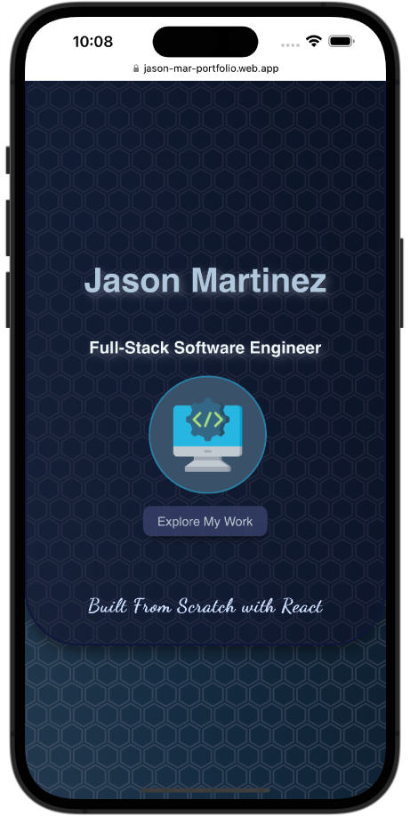

## Jason Martinez

### Software Engineering Portfolio

---

#### Built entirely from scratch with ReactJS + CSS

#### Socials: <a href="https://www.linkedin.com/in/martinez-jason/" target="_blank" rel="noreferrer">LinkedIn</a> | <a href="https://github.com/jasonmar08" target="_blank" rel="noreferrer">GitHub</a>

---

### <a href="https://jason-mar-portfolio.web.app/" target="_blank" alt="Deployed Website" rel="noreferrer">Portfolio Site</a>

---

## Description

When brainstorming my portfolio's development approach, I grappled with using one of the amazing public templates already set up for me, or building a professional portfolio from scratch. Being the life-long student I am, I ultimately decided to start from the ground up, and I am proud to have made this decision. I truly enjoyed planning a deisgn that would showcase my background in biology and healthcare and incorporate the beautiful city of Miami where I grew up in. Adding these personal touches and building out the component hierarchy of my application, as well as implementing animations and a functioning contact form from scratch was truly enjoyable. Although I plan to continously optimize my portfolio as I progress in my Software Engineering journey, I am proud of what I have thus far and hope you enjoy a bit more about this Miami native who transitioned into tech to make a larger impact in my community.

---

## Screenshots

#### Mobile Version

    <pre>
        &nbsp;&nbsp;&nbsp;&nbsp;&nbsp;&nbsp;&nbsp;&nbsp;&nbsp;&nbsp;&nbsp;&nbsp;&nbsp;&nbsp;&nbsp;
    </pre>

#### Browser Version

    <pre>
        &nbsp;&nbsp;&nbsp;&nbsp;&nbsp;&nbsp;&nbsp;&nbsp;&nbsp;&nbsp;&nbsp;&nbsp;&nbsp;&nbsp;&nbsp;
    </pre>

---

## Technologies Used

- JavaScript
- ReactJS
- HTML
- CSS
- Animate On Scroll (AOS) Library
- EmailJS
- Firebase

---

## Future Updates

- [ ] Chat system for immediate contact
- [ ] More animations and optimized UX design
